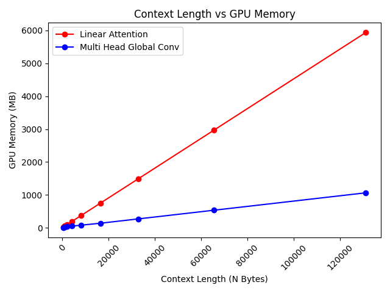

# AI Malware Detection App
An AI powered local web app for scanning byte chunks of portable executable files and  
classifying them as either benign or malicious.

List of Contents:
1. [Dependencies](#dependencies)
2. [Starting Django Server & App Usage](#starting-django-server--app-usage)
3. [Model Training](#model-training)
    - [Portable executable dataset](#portable-executable-dataset)
    - [Data preparation](#data-preparation)
    - [Training](#training)
4. [Benchmarking & Empirical Findings](#benchmarking--empirical-findings)
    - [Developing Custom Architectures](#developing-custom-architectures)
    - [Key Observations During Training](#key-observations-during-training)
    - [GPU Memory Benchmarking](#gpu-memory-benchmarking)
5. [Acknowledgements](#acknowledgements)

## Dependencies

- Python version required: *v3.11.0*
- Python libraries and frameworks required:
    - **Django** *(v5.2.5)*: Web framework for frontend UI and backend server.
    - **torch** *(v2.7.1+cu128)*: Machine learning library for developing and training models with different architectures.
    - **numpy** *(v1.24.3)*: Library for conducting scientific computing on multidimensional arrays.
    - **matplotlib** *(v3.7.1)*: Plotting library for displaying ML model benchmarking graphs.

## Starting Django Server & App Usage

Start the Django server by running the following set of commands below in the root directory.

For Windows OS 11:
```powershell
python -m venv venv
.\venv\Scripts\activate
pip install -r requirements.txt
python -m server.manage migrate
python -m server.manage runserver
```

For Linux and mac OS:
```bash
python -m venv venv
./venv/Scripts/activate
pip install -r requirements.txt
python -m server.manage migrate
python -m server.manage runserver
```

Enter the URL: http://127.0.0.1:8000/main in browser to display the main web page.

## Model Training

### Portable executable dataset

- This project uses the *Malware Detection PE-Based Analysis Using Deep Learning Algorithm Dataset* which contains a set of benign and malicious executable files used to train AI models for malware classification. Dataset is **not** included in this project and can be downloaded from: https://figshare.com/articles/dataset/Malware_Detection_PE-Based_Analysis_Using_Deep_Learning_Algorithm_Dataset/6635642. 
- Credits for this dataset can be found under [Acknowledgements](#acknowledgements).

### Data preparation

Below are the steps used to create the byte chunk dataset using the portable executable files:
1. All benign and malicious files were organized in the following directory structure:
```
./ml_workspace/
    dataset/
        file_dataset/
            clean/
                example_benign1.exe
                example_benign2.exe
                ...
            malicious/
                example_malicious1.exe
                example_malicious2.exe
                ...
```
2. All names of benign and malicious files were renamed to remove the ".exe" file using the `./ml_workspace/utils/remove_exe_ext.py` script to avoid accidental executation of malware on Windows Operating System.
3. All files in `./ml_workspace/dataset/file_dataset` were read as raw byte strings and segmented into fixed length tensor arrays of integers ranging from 0 to 255. 
4. Tensor arrays are stored in separate tensor files located in `./ml_workspace/dataset/tensor_dataset` which avoids having to load the entire dataset during training which can risk out of memory errors.

### Training

AI models were created and trained using the `./ml_workspace/train.py` script which contains hardcoded training hyperparameters. This script was run from the root directory using the following command:
```
python -m ml_workspace.train
```
Model weights and hyperparameters are stored in the `./ml_workspace/model/models` which has the follow directory structure:
```
./ml_workspace/
    model/
        models/
            example_model_1/
                hparams.json
                weights.pt
            example_model_2/
                hparams.json
                weights.pt
```

## Benchmarking & Empirical Findings

### Developing Custom Architectures

Early project development ran into memory and computing bottlenecks when training standard self-attention models on large byte chunks due to local hardware limitations (single NVIDIA GeForce RTX 4050). Mitigating these bottlenecks involved developing two custom architectures that were extensively tested to reduce time and space complexity.
- **Linear/Low rank attention**: Based off the Linformer architecture which uses low rank projections to reduce O(n^2) attention matrix to O(n).
- **Multi Head Global Convolutions (MHGC)**: Custom architecture inspired by state-of-the-art transformers that uses multiple heads of dynamically generated global convolutional kernels instead of attention matrices to extract different global features from byte embeddings. The outputs of MHGC layers are added back to input embeddings to ensure gradient stability.

### Key Observations During Training

Below were important details that were noted during empirical and qualitative observation while training models that used MHGC, standard self-attention and linear/low rank attention:

**Training Duration**
- Models that used MHGC layers had significantly faster training duration than linear and standard self attention model with differences in training duration that grew exponentially when processing longer byte chunks.
- Linear/Low rank attention models were able to process byte chunks significantly faster than standard self-attention models due to reduced time complexity of the attention matrix.

**GPU Memory Usage**
- MHGC models are able to maintain significantly lower GPU memory usage than attention models by generating kernels dynamically using a trainable projection matrix instead of storing global kernels that directly scale to context window size.
- Linear/Low rank attention models consumed more GPU memory than MHGC models as K and V projection matrices must directly scale with the size of the context window and thus more susceptible to Out-Of-Memory (OOM) errors than MHGC.

**Loss Convergence & Generalisation**
- MHGC and linear/low rank attention models shared the same performance when it came to loss convergence.
- All models underperformed when classifying byte chunks of unseen executable files as a result of insufficient compute and training data.

***IMPORTANT NOTE***: Quantitative training analysis was not a priority at the time of training existing models in `./ml_workspace/model/models/`. Obtaining quantitative results was deemed unviable as the training process on large enough byte datasets for a single model was significantly memory intensive and time consuming spanning hours to days.

### GPU Memory Benchmarking

The MHGC and linear attention architectures were benchmarked for their GPU memory usage on power-of-two context lengths starting from 512 to 131,072 bytes using the following command. 
```
python -m ml_workspace.arch_benchmark.benchmark
```
All test models used the same JSON hyperparameter configuration below to keep results as unbiased as possible.
```python
default_json_config = {
    "heads": 16, # Number of heads in each linear attention/MHGC layer.
    "blocks": 3, # Number of linear attention/MHGC layers.
    "embedding_len": 32, # Byte token embedding dim.
    "attn_embedding_len": 16, # Dimension of Q and K vectors in linear attention, or kernel dimension in MHGC.
    "low_rank_proj": 256, # Low rank projection dimension for linear attention.
    "pos_encoding_type": "sinusoidal", # Inject positional information into embeddings.
    "kernels_per_head": 3, # Number of kernels in each MHGC head.
    "sinusoidal_n": 10000, # Constant value for generating sinusoidal positional encodings.
    "mlp_dense_layer_dims": [128] # Dimensions for final dense layers to process single contextualised embedding.
}
```
A graph was generated using matplotlib that shows models using MHGC layers utilized significantly less GPU memory than linear attention as context window size increased.  


## Acknowledgements

Model architecture/s:
- This project includes implementations of linear attention to reduce memory usage from the paper "Linformer: Self-Attention with Linear Complexity", reference below:  
Wang, S., Li, B. Z., Khabsa, M., Fang, H., & Ma, H. (2020). *Linformer: Self-Attention with Linear Complexity.* ArXiv.org. https://arxiv.org/abs/2006.04768

- Reference for the paper "Attention Is All You Need" featuring the original transformer architecture and self-attention mechanism:  
Vaswani, A., Noam Shazeer, Parmar, N., Jakob Uszkoreit, Jones, L., Gomez, A. N., Kaiser, L., & Illia Polosukhin. (2017, June 12). Attention Is All You Need (1706.03762v7). arXiv. https://arxiv.org/abs/1706.03762v7

Machine learning dataset:
- Name: “Malware Detection PE-Based Analysis Using Deep Learning Algorithm Dataset”  
- Authors: Anh Pham Tuan, An Tran Hung Phuong, Nguyen Vu Thanh, Toan Nguyen Van
- Dataset date: 22/6/2018
- DOI: https://doi.org/10.6084/m9.figshare.6635642
- License: Creative Commons Attribution 4.0 International (CC BY 4.0)
    - License link: https://creativecommons.org/licenses/by/4.0/